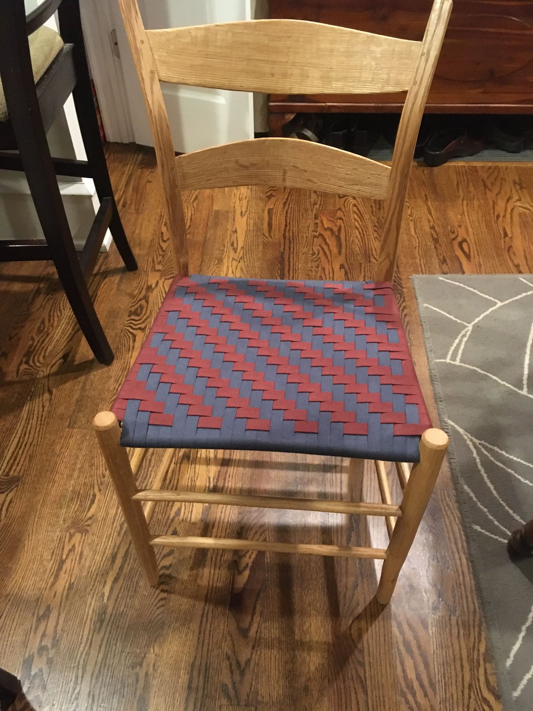

# mchughmatthew.github.io — Project Notes

A reference for this website project. Written to orient an AI assistant (e.g.
Claude Cowork) or a new collaborator: what the site is, how it is built, the
conventions to follow when editing, and what is still outstanding.

---

## At a glance

- **Owner:** Matthew D. McHugh — Professor & Independence Chair for Nursing
  Education, University of Pennsylvania School of Nursing; Director of CHOPR
  (Center for Health Outcomes and Policy Research).
- **What it is:** A personal academic website. Custom-built static
  HTML/CSS/JS — no framework, no build step.
- **Repository:** `mchughmatthew/mchughmatthew.github.io`
- **Deployment:** GitHub Pages. Pushing to the `main` branch publishes the
  live site automatically.
- **Local working copy:** `/Users/mchughm/Documents/GitHub/mchughmatthew.github.io`
- **Contact email used throughout the site:** `mchughm@nursing.upenn.edu`
- **Google Analytics tag:** `G-5LNP9W9B62` (present on every page)

### How a change goes live

1. Edit files in the local working copy.
2. Review the changes in GitHub Desktop (it shows a diff of every change).
3. Commit with a short message, then Push.
4. GitHub Pages redeploys within a minute or two.

---

## Site structure

Every page is a **standalone HTML file** with its own embedded `<style>` and
`<script>`. There is no shared CSS/JS file — the design system is duplicated
into each page. When editing or adding a page, keep it consistent with the
others (see Design System below).

### Homepage — `index.html`

Sections, in order: hero, About (with a sidebar for Education and Training
Opportunities), Research, Projects, Publications (featured), Contact, footer.
The featured-publications grid is generated by JavaScript that reads
`publications.bib` and shows the most recent entries.

### Research topic pages

Linked from the Research section of the homepage:

- `nursestaffing.html` — Nurse Staffing & Policy
- `corporatization.html` — Corporatization in Healthcare
- `burnout.html` — Clinician Burnout
- `workenvironment.html` — Work Environments
- `healthequity.html` — Health Equity & Disparities
- `policy.html` — Policy Evaluation & Methods

### Project pages

Linked from the Projects section of the homepage:

- `aacnhwe.html` — AACN-HWE Survey
- `nurses4all.html` — Nurses4All
- `nurses4allbc.html` — Nurses4All@BC
- `magnet4europe.html` — Magnet4Europe Initiative
- `usmagnets.html` — U.S. Clinician Wellbeing Study
- `rn4cast.html` — RN4CAST International Studies

### Other pages

- `publications.html` — full searchable, year-grouped publication list (~160 entries)
- `news.html` — News & Media page: all Penn Nursing press releases and media
  coverage of CHOPR research (sourced from Ed Federico's announcement emails),
  year-grouped with Press Release / Media Coverage filter buttons. Rendered
  by JavaScript from `news.json` — to add an item, add an object to the
  JSON (no HTML editing needed).
- `training.html` — training opportunities / T32 program
- `chopr_history.html` — history of CHOPR (note: underscore in the filename)

### Homepage news carousel

`index.html` has an "In the News" section (`#news`, navy background, between
Publications and Contact) — an auto-rotating carousel (6s interval, pauses on
hover, arrows + dots) built by JavaScript from `news.json`. It shows items
flagged `"featured": true` (newest first), filled to six with the most
recent unflagged items. "All Coverage →" links to `news.html`.

### news.json (single source of news data)

Both the news page and the homepage carousel render from `news.json` in the
repo root. Item schema:

```json
{
  "date": "2026-05-05",          // ISO date — controls sort & display
  "type": "release",             // "release", "coverage", or "recognition"
                                 // (recognition = awards, honors, endorsements)
  "title": "Headline text",
  "url": "https://...",          // main link; null if none exists
  "source": "Medical Care",      // journal (releases) or outlet(s) (coverage)
  "blurb": "One-two sentences; may contain inline <a> links.",
  "featured": true               // optional — puts item in homepage carousel
}
```

To add news: append the object to `news.json` (keep newest-first order for
readability; JS re-sorts regardless), set `featured` on items that should
rotate on the homepage, and unset it on items rotating out. The
`website-news-intake` skill (Cowork) automates this from Gmail — emails
labeled `to_website`, plus Ed Federico's announcement emails.

### Workshop section (personal — hobbies, added most recently)

A hub-and-spoke set of pages about Matthew's hand-craft work outside of
research. See the dedicated section further down.

- `workshop.html` — hub / landing page
- `workshop-bowls.html` — turned and hand-tool bowls
- `workshop-logs.html` — "From Log to Blank" process page (child of Bowls)
- `workshop-chairs.html` — two chair projects
- `workshop-metalwork.html` — welding and copper

### Supporting files

- `cv.pdf` — CV, in the repo root; linked from the nav and hero.
- `publications.bib` — BibTeX source for the publication lists.
- `images/` — site images. Workshop photos go in `images/workshop/`.
- Favicon is loaded from `nursing.upenn.edu`.

---

## Design system

Shared across every page. Defined as CSS variables in each page's `<style>`.

**Fonts** (loaded from Google Fonts):
- Cormorant Garamond — display headings (`h1`, `h2`, card titles)
- DM Sans — body text
- DM Mono — small labels, eyebrows, monospace details

**Colors** (CSS variables):
- `--navy` `#0c1b33` — hero and footer background
- `--navy-mid` `#162645`, `--navy-light` `#1e3560`
- `--gold` / `--gold-light` `#fff8db` — light accent (used on dark backgrounds)
- `--cream` `#f8f4ef`, `--warm-white` `#fdfaf6` — light backgrounds
- `--text` `#1a1a2e`, `--muted` `#6b7280`, `--border` `#e5dfd6`

**Layout & behavior:**
- Fixed top navigation bar; a hamburger menu replaces it on screens ≤768px.
- Navy hero section at the top of each page; navy footer at the bottom.
- Sections use a small DM Mono "section label" above a Cormorant `h2`.
- Scroll-reveal animations fade content in as it enters the viewport.

---

## Conventions to follow when editing

- **Match the design system.** Any new page or section should reuse the
  fonts, color variables, nav, and footer above so it looks native.
- **Email links are plain `mailto:`** — e.g.
  `<a href="mailto:mchughm@nursing.upenn.edu">`. Do not introduce obfuscated
  or scripted email links.
- **Keep the Google Analytics tag** (`G-5LNP9W9B62`) on every page.
- **Publications:** prefer DOI links over plain URLs. Link logic is
  `doi ? https://doi.org/<doi> : url`.
- **Use CSS classes, not inline styles, for anything with a hover state** —
  inline styles cannot carry `:hover` rules.
- When generating a long HTML file, verify it is not truncated — confirm it
  ends with `</body></html>` and the final `<script>` is complete.

---

## The Workshop section (detail)

A hub page plus four sub-pages, all in the shared design system, with image
galleries and a click-to-enlarge lightbox.

### Page map

```
workshop.html              hub / landing page (3 category cards)
├─ workshop-bowls.html      Turned Bowls + Hand-Tool Bowls sections
│  └─ workshop-logs.html    "From Log to Blank" — 5-step process page
├─ workshop-chairs.html     Appalachian Ladderback + Sackback Windsor
└─ workshop-metalwork.html  single combined steel + copper gallery
```

### Image folder and naming

All Workshop photos live in `images/workshop/`. Galleries expect sequential,
zero-padded filenames per category:

- `bowls-turned-01.jpg`, `bowls-turned-02.jpg`, …
- `bowls-handtool-01.jpg`, …
- `chair-ladderback-01.jpg`, …
- `chair-windsor-01.jpg`, …
- `metal-01.jpg`, … (one combined gallery)
- `logs-01.jpg`, … (one image per process step)

The number is simply the display order on the page — it carries no other
meaning, so files should be numbered in the order they should appear.

### Placeholder vs. real gallery images

Each gallery currently holds **placeholder** figures. To show a real photo,
replace a placeholder:

```html
<figure class="gallery-item placeholder">
  <span>images/workshop/chair-ladderback-01.jpg</span>
</figure>
```

with a real figure:

```html
<figure class="gallery-item"
        data-full="images/workshop/chair-ladderback-01.jpg"
        data-caption="Short caption, e.g. Black walnut, 2024">
  
</figure>
```

On the log-processing page, step images use `step-figure` instead of
`gallery-item` (same placeholder/real pattern). Each HTML file has a comment
block above its first gallery showing this exact markup. `<figure>` blocks can
be freely added or removed — the grid reflows on its own. Real figures (those
with `data-full`) open in a lightbox on click; placeholders do not.

### Placeholder text

Italic, bracketed text such as `[Describe your turned bowls …]` marks copy
that still needs to be written by Matthew — intros, the chair build stories,
the log-process step descriptions, and the chair "project meta" lines.

---

## Open / outstanding items

- ~~Nav link rollout~~ — done (July 2026): "News" and "Workshop" nav links
  are now present on every page site-wide, and every page now has the
  mobile hamburger menu (`chopr_history.html` uses its own older but
  working hamburger pattern; all others use the standard
  `nav-toggle`/`nav-menu` pattern).
- **Workshop content:** galleries are still placeholders — add the real
  photos to `images/workshop/` and swap in real `<figure>` blocks; replace
  the bracketed `[text]` with real copy.
- **Social preview image:** `images/og-preview.jpg` (1200×630) is referenced
  by the Open Graph / Twitter tags on every page but has not been created
  yet — it needs to be made and committed.
- **Verify a fact:** the year given for when Matthew became CHOPR director
  (currently 2016 in `chopr_history.html`) should be confirmed.
